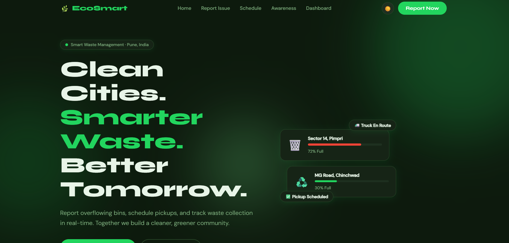
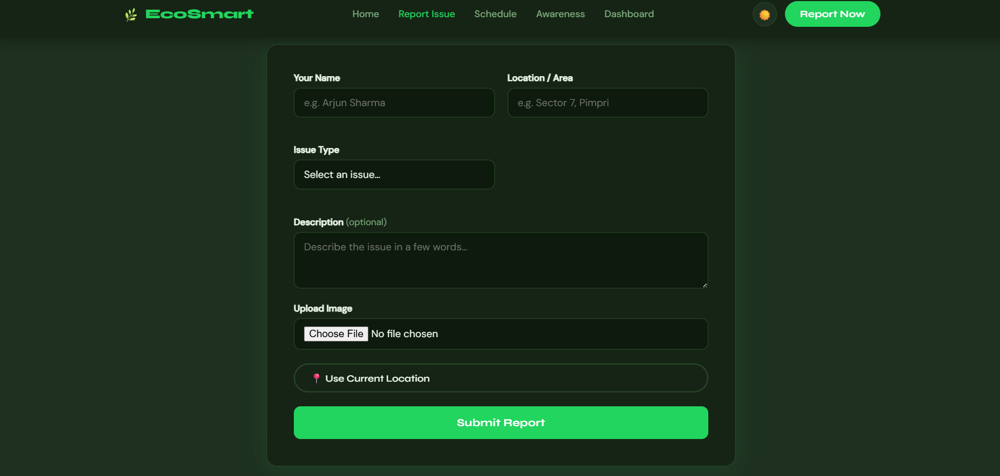
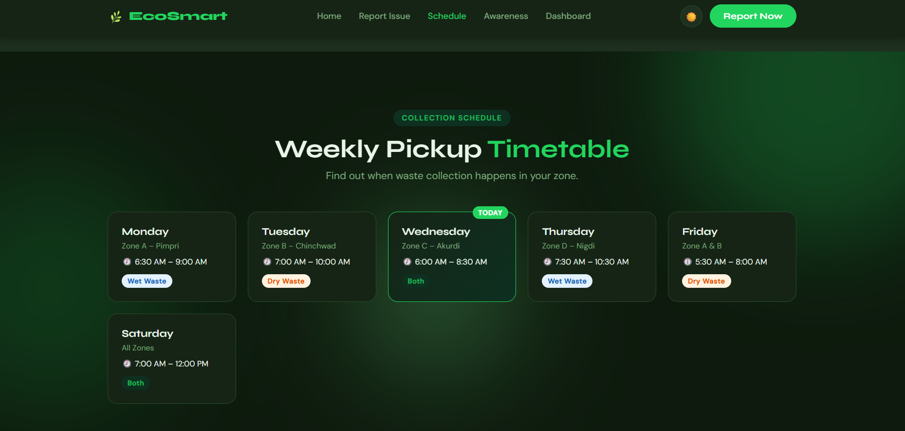
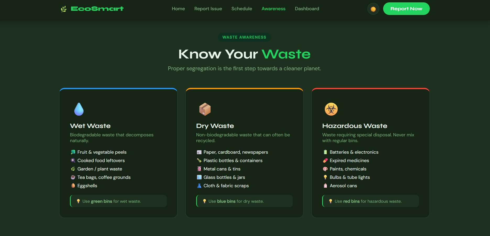
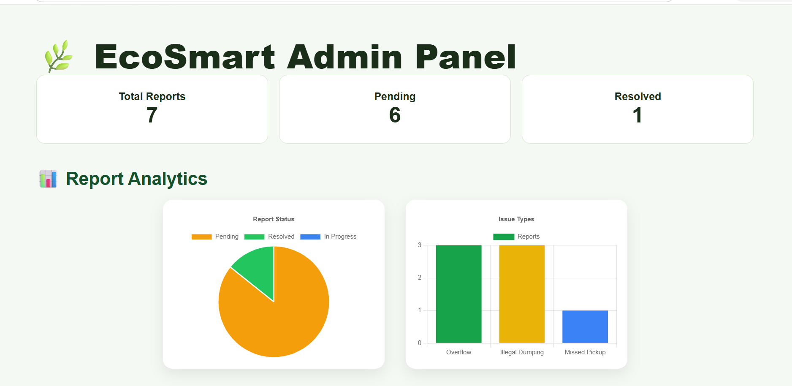
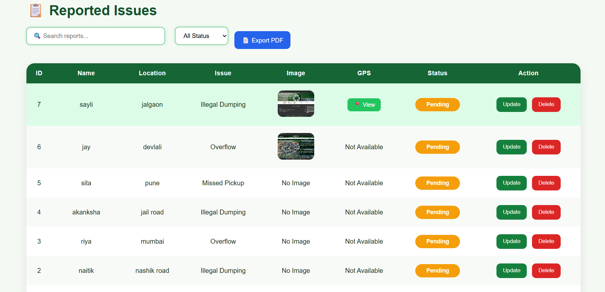

# 🌍 EcoSmart - Smart Waste Management System

A modern full-stack Smart Waste Management System built using **Flask, MySQL, HTML, CSS, and JavaScript**. The application enables citizens to report waste-related issues with image uploads and location details while providing administrators with a dashboard to monitor, manage, and analyze reports efficiently.


---

## 🚀 Features

- 📝 Report waste issues
- 📷 Image upload support
- 📊 Admin dashboard
- 📈 Analytics using Chart.js
- 🔍 Search reports
- 🌙 Dark mode
- 📱 Responsive design
- ✅ Update report status
- 🗑️ Manage waste reports

---

## 🛠️ Tech Stack

### Frontend
- HTML5
- CSS
- JavaScript

### Backend
- Python
- Flask

### Database
- MySQL

### Libraries
- Flask
- Flask-CORS
- mysql-connector-python
- Chart.js

---

## 📂 Project Structure

```
Project/
│
├── app.py
├── db.py
├── admin.html
├── admin.css
├── admin.js
├── index.html
├── style.css
├── script.js
├── requirements.txt
├── README.md
└── .gitignore
```

---

## ⚙️ Installation

### 1. Clone the repository

```bash
git clone https://github.com/PATIL-BHAGYASHREE-2926/E-Waste-Management-System.git
```

### 2. Move into the project

```bash
cd E-Waste-Management-System
```

### 3. Install dependencies

```bash
pip install -r requirements.txt
```

### 4. Configure MySQL

- Create the required database.
- Update the database credentials in `db.py`.

### 5. Run the application

```bash
python app.py
```

Open:

```
http://localhost:5000
```

---

## 📸 Screenshots

### 🏠 Home Page



### 📝 Report Issue



### 📅 Collection Schedule



### ♻️ Waste Awareness




### 👨‍💻 Admin Dashboard



### 📊 Dashboard



---

## 🎯 Future Improvements

- ☁️ Cloud Deployment
- 📧 Email Notifications
- 🤖 AI-based Waste Classification
- 📱 Mobile Application
- 📍 Live Truck Tracking
- 🔔 Push Notifications


---
## 👩‍💻 Developer

**Bhagyashree Patil**

Computer Engineering Student
Aspiring Full Stack & Cyber Security Engineer
---

## ⭐ If you like this project

Give this repository a ⭐ on GitHub!


